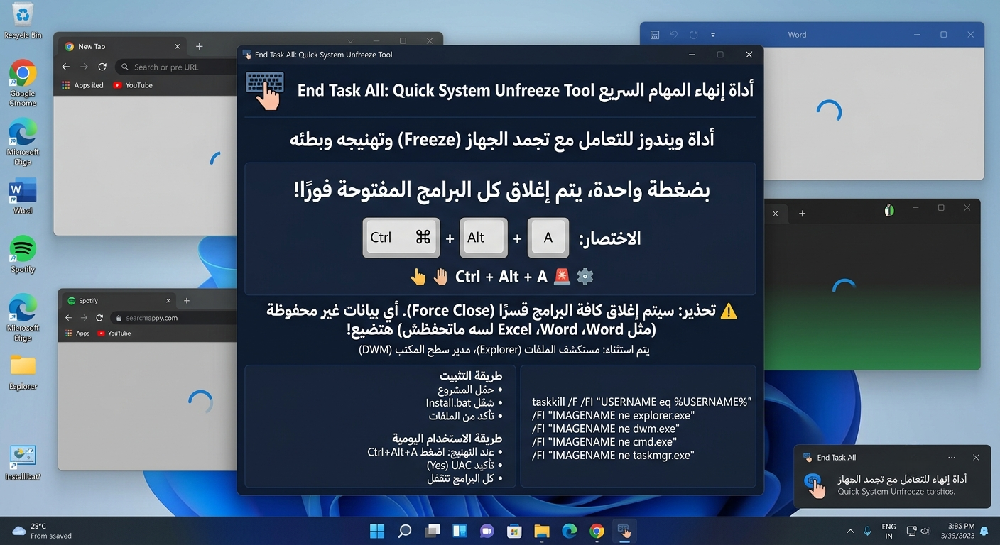

<div align="center">



# End Task All

**أداة سريعة وخفيفة لويندوز تنهي كل البرامج العالقة بضغطة واحدة**

[](#)
[](./LICENSE)
[](https://github.com/ibrahimmustafacv)

</div>

---

## 📖 نبذة عن المشروع

**End Task All** أداة بسيطة لويندوز بتحل مشكلة تعليق أو هنج الجهاز بسبب تشغيل عدة برامج في نفس الوقت. بدل ما تقفل كل برنامج لوحده، ضغطة اختصار كيبورد واحدة (`Ctrl + Alt + A`) بتقفل كل البرامج المفتوحة فورًا، وتسيبلك الأساسيات (مستكشف الملفات وسطح المكتب) شغالة عادي.

---

## ⚠️ تنبيه هام قبل الاستخدام

> الأداة بتقفل **كل البرامج المفتوحة بالإجبار (Force Close)** ما عدا:
> - مستكشف الملفات (`explorer.exe`)
> - مدير سطح المكتب (`dwm.exe`)
>
> **أي عمل غير محفوظ في أي برنامج مفتوح (Word، Excel، ألعاب... إلخ) هيضيع فورًا وبدون تراجع.**
> استخدم الأداة فقط وقت التعليق الفعلي أو الحاجة لتحرير موارد الجهاز بسرعة.

---

## ✨ المميزات

| الميزة | الوصف |
|---|---|
| ⚡ سرعة فائقة | إغلاق كل البرامج في ثانية واحدة |
| ⌨️ اختصار كيبورد | `Ctrl + Alt + A` يعمل من أي مكان |
| 🛡️ تنبيه أمان | نافذة تأكيد من ويندوز قبل التنفيذ (UAC) |
| 🪶 خفيف جدًا | بدون تثبيت برامج خارجية، كله مدمج في ويندوز |
| 🧩 سهل التخصيص | كود مفتوح بالكامل وقابل للتعديل |

---

## 🚀 طريقة التثبيت

```
1. حمّل المشروع كامل → Code > Download ZIP
2. فك الضغط
3. تأكد إن ملفي Install.bat و CreateShortcut.ps1 في نفس المجلد
4. شغّل Install.bat (دبل كليك) واضغط Yes عند الطلب
```

بعد التثبيت، هيظهرلك اختصار جديد على سطح المكتب باسم **"End Task All"** بنفس الأيقونة والاختصار الجاهز.

---

## 🖱️ طريقة الاستخدام

عند تعليق أو بطء الجهاز:

1. اضغط **`Ctrl + Alt + A`** من الكيبورد
2. هتظهر نافذة تأكيد أمان من ويندوز (**User Account Control**)
3. اضغط **`Enter`** أو **`Yes`**
4. تُغلق كل البرامج المفتوحة فورًا 🎉

---

## 🔁 بديل بدون اختصار كيبورد

لو تفضّل التشغيل اليدوي بدل اختصار الكيبورد، استخدم ملف `EndTaskAll.bat` المرفق، واللي بيطلب تأكيد كتابي (`Y`) قبل التنفيذ.

---

## ⚙️ كيف تعمل الأداة؟

تعتمد الأداة على أمر `taskkill` المدمج في ويندوز مع مجموعة فلاتر (Filters) تحدد:

- البرامج الخاصة بالمستخدم الحالي فقط
- استثناء العمليات الأساسية للحفاظ على استقرار النظام

```batch
taskkill /F /FI "USERNAME eq %USERNAME%" /FI "IMAGENAME ne explorer.exe" /FI "IMAGENAME ne dwm.exe"
```

---

## 🧰 متطلبات التشغيل

- ويندوز 7 أو أحدث
- لا يتطلب تثبيت أي برامج إضافية

---

## 📄 الترخيص

هذا المشروع مرخّص تحت [MIT License](./LICENSE) — حر الاستخدام والتعديل والتوزيع.

---

## 👨‍💻 المطوّر

<div align="center">

**Ibrahim Mustafa**

[](https://github.com/ibrahimmustafacv)

</div>

---

<div align="center">
<sub>لو المشروع عجبك، متنساش تدّيله ⭐ على GitHub</sub>
</div>
